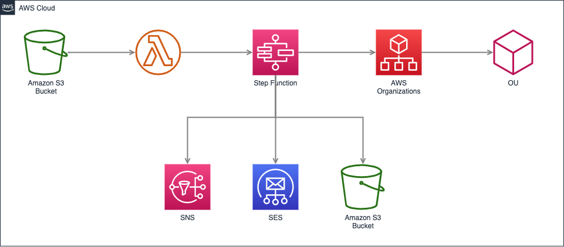
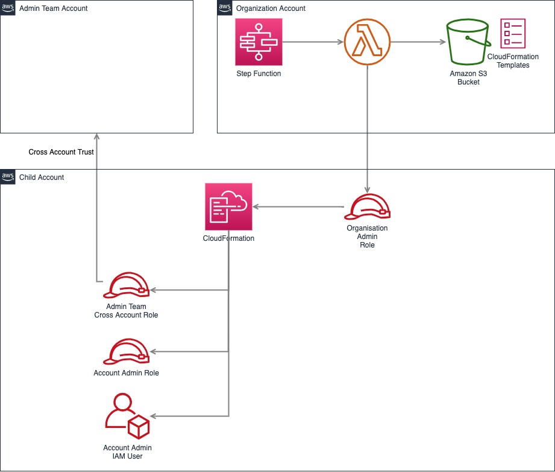

# AWS Account Vending Machine

This is a project to setup a serverless and dynamic Account Vending Machine for AWS accounts. 

## Overview

The solution interacts with AWS Organizations to create accounts and Organizational Units (OU).  
It uses Lambda and Step Functions to coordinate the different steps in the process.  
Amazon SNS and SES is used for notifications and Amazon S3 is used both for triggering the creation and store information about created accounts.  
  


### Creation Steps

1. Creates a new Organization Unit, if it doesn't already exists, with the specified name.
2. Creates a new AWS account with the specified name.
3. Moves the new AWS account in under the OU.
4. Assumes the Organization Admin Role in the new account and deploys specified CloudFormation templates. In default setup and events that would be:
   1. Create a cross account admin role with trust to the specified admin account number and with the specified name.
   2. Create an IAM User with specified username and password, this user is considered the account owner.
5. Notifies the Organization admins and the account owner that the create process is completed.

## Setup

The solution uses Simple Email Service (SES) to send e-mail to the IAM user that is considered the owner of the account.  
Therefor you must make sure both the e-mail address used as sender and all of the receiving addresses has been whitelisted in SES.  
Either by leaving the sandbox or verifying the entire domain.  

Deploy the CloudFormation template, account-vending-machine.yaml into the Organization master account.  
Specify the two parameters needed; the e-mail address that will be used as sender in SES and a unique identifier (Name) that will be appended to resources that need to be globally unique, like S3 buckets.  
Click on the `Launch Stack` button to start deployment.
[](https://console.aws.amazon.com/cloudformation/home#/stacks/new?stackName=amv-infrastructure&templateURL=https://jimmyd-public-cfn-eu-west-1.s3-eu-west-1.amazonaws.com/account-vending-machine.yaml)

Upload the two CloudFormation templates in the solution to the created S3 bucket for child account templates, bucket name can be found in outputs of the account-vending-machine.yaml deployment.  

## Account creation process

To create an account an json event file describing the account should be uploaded to the created S3 bucket. This will kickstart the entire process.  
The entire process is fully automatic and both the Organization Admin team and the account owner (IAM user) will be notified when the account is created.  
  
The solution will deploy CloudFormation templates into the created account to do basic setup.  
The solution provide two templates that will create an IAM user for the account owner (Admin) and setup cross account access for an Administrator role that can be used be the Organization Admin team.  



However the solution can deploy any number of CloudFormation templates, this is specified in the account creation json file.  
To deploy additional templates make sure they are present in the CloudFormation S3 bucket and add item to the _cfnTemplates_ array in the event json file.

## Account Json file

Below is an example of an event file to create a new account. More data will be added to the event during create process. For CloudFormation template parameters use {{key-name}} to dynamically replace with values from the event,

```json
{
    "accountName": "Test Account",
    "accountEmail": "awsaccount@example.com",
    "ouName": "TestAccounts",
    "iamUser": "iamuser@example.com",
    "iamPassword": "InitialPassword",
    "accountRole": "organization-account-role",
    "adminAccount": "123408753636",
    "adminAccountRole": "cross-account-admin-role",
    "cfnTemplates": [
        {
            "templateName": "account-iam-user.yaml",
            "stackName": "avm-owning-iam-user",
            "parameters": [
                {
                    "key": "Username",
                    "value": "{{iamUser}}"
                },
                {
                    "key": "Password",
                    "value": "{{iamPassword}}"
                }
            ]
        },
        {
            "templateName": "cross-account-admin.yaml",
            "stackName": "avm-cross-account-admin",
            "parameters": [
                {
                    "key": "RoleName",
                    "value": "{{adminAccountRole}}"
                },
                {
                    "key": "RequireMFA",
                    "value": "true"
                },
                {
                    "key": "OtherAccountNumber",
                    "value": "{{adminAccount}}"
                }
            ]
        }
    ]
}
```

The following data will be added to the event during the create process, prior to CloudFormation deployment.

```json
{
    "rootOuId": "r-xxxx",
    "ouId": "ou-xxxx-yyyyyyyy",
    "accountRequestId": "car-hgdjagdgjdgsdh",
    "createAccountStatus": "STATUS",
    "accountId": "4963463846832"
}
```


## Credits
Inspired by the [AWS Blog Post](https://aws.amazon.com/blogs/mt/automate-account-creation-and-resource-provisioning-using-aws-service-catalog-aws-organizations-and-aws-lambda/)